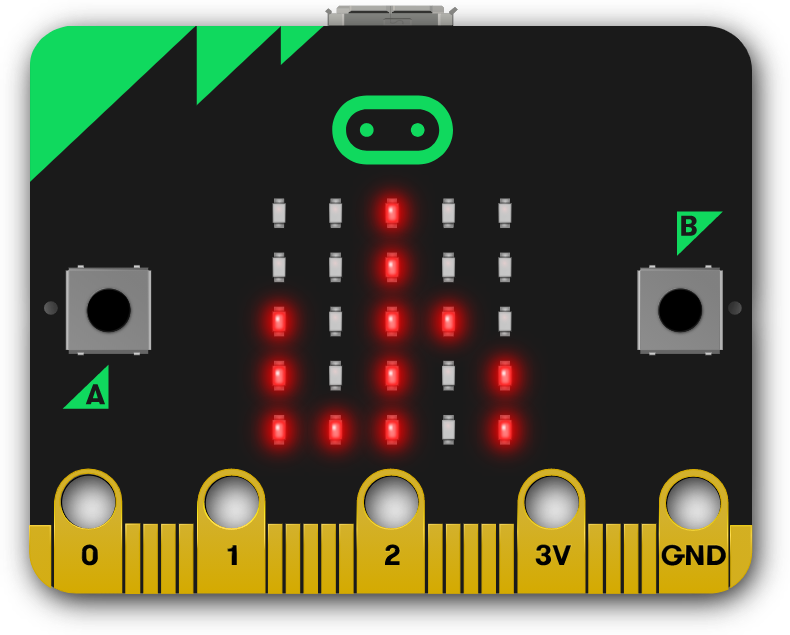
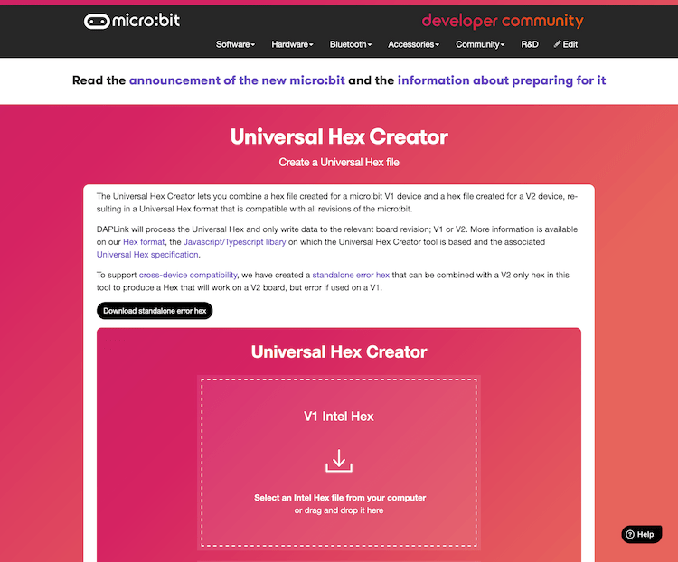

# micro:bit Universal Hex TypeScript Library



[](https://circleci.com/gh/microbit-foundation/microbit-universal-hex)

TypeScript/JavaScript library to create micro:bit Universal Hex files for
micro:bit.

The Universal Hex file format was created to be able to contain the binary data
for micro:bit V1 and V2 boards in a single file, so that it works in all
versions of the micro:bit.

## Documentation

The documentation can be found in
https://microbit-foundation.github.io/microbit-universal-hex/.

## npm Package

To add this package to your project:

```
npm install @microbit/microbit-universal-hex
```

## Web Tool



An implementation example can be found in the
[docs/examples/webtool.html](docs/examples/webtool.html) file. This web tool can
generate a Universal Hex from two Intel Hex files.

It can be accessed online on this URL:
https://tech.microbit.org/software/universal-hex-creator/

## License

This software is under the MIT open source license.

[SPDX-License-Identifier: MIT](LICENSE.md)
